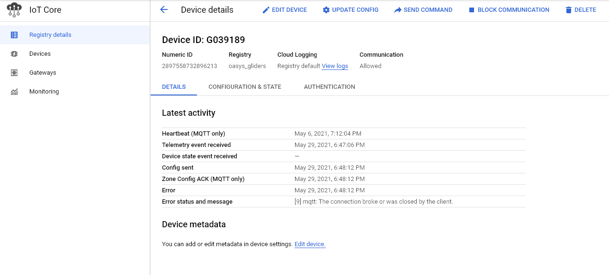

# Part 1. Connecting to Google IoT Core:

**Official google cloud documentation. Provides more detailed information on setting up your IoT device:**

https://cloud.google.com/iot/docs/how-tos/mqtt-bridge

This is part 1 of a guide for setting up a chain of communication from your device to the front-end.

This is a guide on how to connect your device to Google's IoT Core through MQTT. Feel free to give feedback on if anything is not clear. Good luck :)


## Google Cloud Platform - GCP

The GCP provides an overview of services offered by Google to handle a variety of tasks, including IoT services. The most relevant services for this project include:

- **GCP console**: Quick access to the other related services.
- **IoT Core**: Handles communication between Google's brokers and your IoT device.
- **Cloud functions**: Allows the deployment of functions that run whenever a specified event occurs.
- **Pub/Sub**: Handles subscriptions and publishes to topics. Functions similarly to MQTT with some extra features.
- **Firestore**: Cloud database service.

There are also features for handling administrative roles and overview of usage + billing. These will not be covered here.

All of these services can be accessed as long as you are within the GCP ecosystem. When in doubt, just use the search bar :)


## 1. Configuring IoT Core

As discussed previously, this service handles communication to and from IoT devices. IoT Core supports MQTT and HTTP communication, but this guide will focus solely on MQTT.


### 1.a. Creating a registry

First, the user needs to create a registry for adding new devices. An existing registry already exists for underwater gliders. To keep things organized, it is better to create a separate registry for new types of devices.


Registry ID and region can be chosen freely by the user.

The most important field is the **Cloud Pub/Sub topics**. Any messages received from IoT devices in this registry will be routed to the specified topic. The default topic for the project is ``` projects/oasys-2d5b2/topics/data ```, but feel free to create a new one for your registry.

Other parameters can be set here as well. These can be changed by the user, but the default values should be sufficient.


Once the registry is set up, we can add new devices.


### 1.b. Adding devices

New devices can be added within the **Devices** tab.


It is important to note the **device ID** used when creating a new device. This will be used when setting up the embedded side.
Everything else can be left to their default values.

Also keep note of the **authentication** section. We will come back to this section later once we create a public key for your device.


### 1.c. Other nifty features within the devices tab
 
- **Update config**: Updates the message that is sent to the device every time it connects to IoT Core. 
- **Send command**: Sends a message to the device. The device needs to be connected to MQTT during the time the command is sent.
- **Configuration & state**: Shows a backlog of previously set configs.



## 2. Embedded prerequisites

This section discusses the necessary files needed before setting up your device.


### 2.a. Google root certificates (CA)

Google Cloud requires TLS 1.2 when establishing a connection. Server side and client side authentication is supported with only the former being required, hence the need for Google's root certificate (CA).

These can be acquired from google's official documentation ([full CA download](https://pki.goog/roots.pem), [minimal CA download](https://pki.goog/gtsltsr/gtsltsr.crt))


### 2.b. Authentication - public/private key pairs and JWTs

**Google cloud documentation:**

https://cloud.google.com/iot/docs/how-tos/credentials/keys

A public/private key pair needs to be generated by the user to allow authenticate the device in IoT Cloud. The public key is used directly on IoT Core as will be shown below. The private key is used further to sign a JSON Web Token (JWT) as proof of the device's identity.

This repository contains a python script for creating the key pairs ([link here](https://github.com/Canellu/BachelorNordicSemi/blob/embedded/embedded/test/uart_mqtt_gps/src/private_info/create_keys.py)). COME BACK HERE AND FIX!!

List of arguments:

- **-h or --help**: Provides information about the usable arguments.
- **-d or --device**: Name of the device, output files use this name.
- **-e or --ecdsa**: Generates an elliptic curve key
- **-r or --rsa**: Generates an RSA key

Example usage. This produces an elliptic curve key pair with ``` G039189 ``` as the device name.

```
python create_keys.py -d G039189 -e
```

The output produces a a public and private key pair. 
Expected output from create_keys.py:


The public key needs to be added into the authentication section in [**IoT Core - devices tab**](). The image below shows the relevant field.


The private key needs to be added in the device itself. This is used in creating the JWT needed for authentication upon connecting to IoT Cloud.
Notice that a .c file has also been created. This file can be used instead of the private certificate for easier integration when developing embedded systems in C.


## 3. Connecting your device using MQTT

This part assumes the user to have some familiarity with MQTT. As such, this section will mostly show the necessary parameters for establishing a connection with IoT Core.


### 3.a. TLS connection

As mentioned earlier, TLS 1.2 needs to be used when communicating with Google's IoT brokers. The connection needs to be verified using the CA certificates. The exact process on how to do this varies depending on the embedded ecosystem used and the libraries included.


### 3.b. MQTT parameters

Note: 
- Terms written in CAPITAL letters denote variables. 
- The variables need to match the parameters set in IoT Core

These parameters are only written in pseudo-code form.

```
broker    = "mqtt.googleapis.com:8883"
                   OR 
            "mqtt.googleapis.com:443"

client_id = "projects/PROJECT_ID/locations/REGION/registries/REGISTRY_ID/devices/DEVICE_ID"

username  = "{blank}"                         // optional, not used by IoT Core
password  = "{JWT}"                           // mandatory, details on JWTs below
qos       = "{0 OR 1}"                        // IoT Core does not support QoS 2
pubs      = "/devices/DEVICE_ID/events"       // default publish topic
subs      = "/devices/DEVICE_ID/commands/#"   // default "live" sub, receives command message
                   AND/OR
            "/devices/DEVICE_ID/config"       // alt sub, receives the config message
```

An example using a test glider can be seen below, with the exception of the password field.

```
broker    = "mqtt.googleapis.com:8883"
client_id = "projects/oasys-2d5b2/locations/europe-west1/registries/oasys_gliders/devices/G039189"

username  = ""
password  = "{JWT}"
qos       = "1"
pubs      = "/devices/G039189/events"
subs      = "/devices/G039189/commands/#",
            "/devices/G039189/config"
```


####  Note on JWTs

**Google cloud documentation:**

https://cloud.google.com/iot/docs/how-tos/credentials/jwts

Several libraries include JWT generators that are readily useable. Otherwise, documentation on creating JWTs can also be found in the link above. The **private key** generated from the key pair needs to be used when creating the JWT.

### 3.d. Testing!

With all of these steps, your device should (hopefully) now be set up and ready for communicating with IoT Core. The only thing left to do is run the setup and see if it works.

The appropriate device within the **devices** tab in IoT Core should update accordingly if things are working. Any potential errors with the MQTT communication should also be reported within the ``` error status and message ``` field.

## ---------- End - Feedback appreciated ----------
