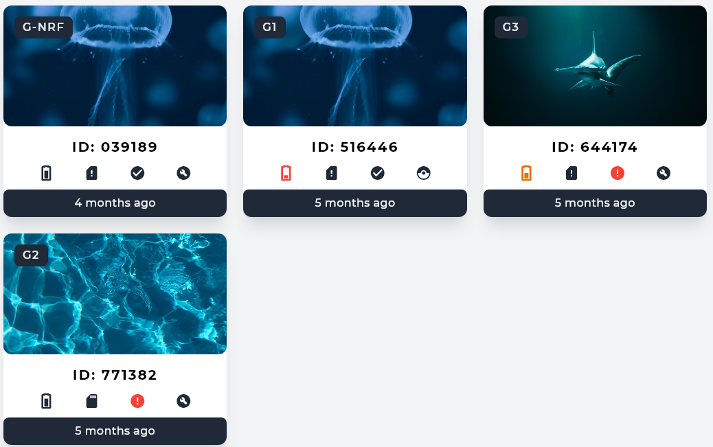
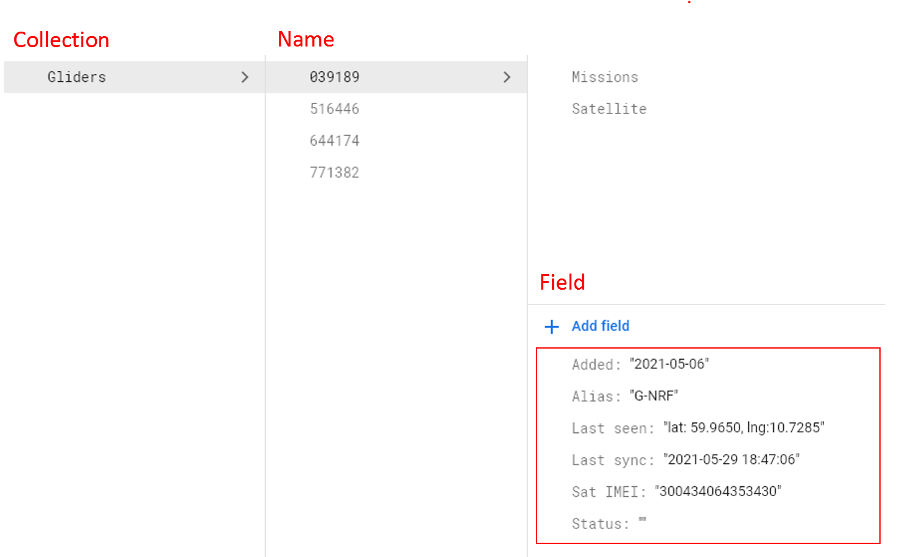
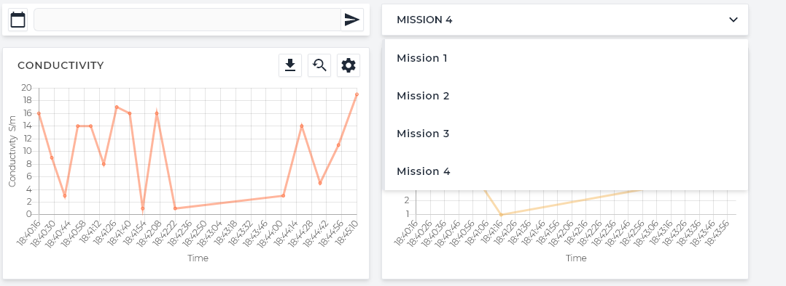
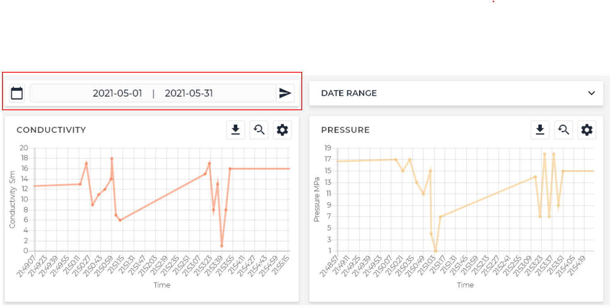
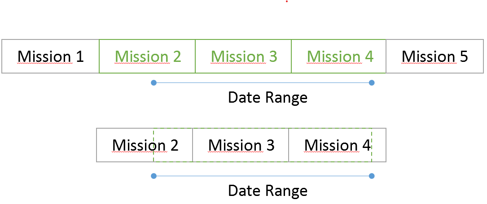
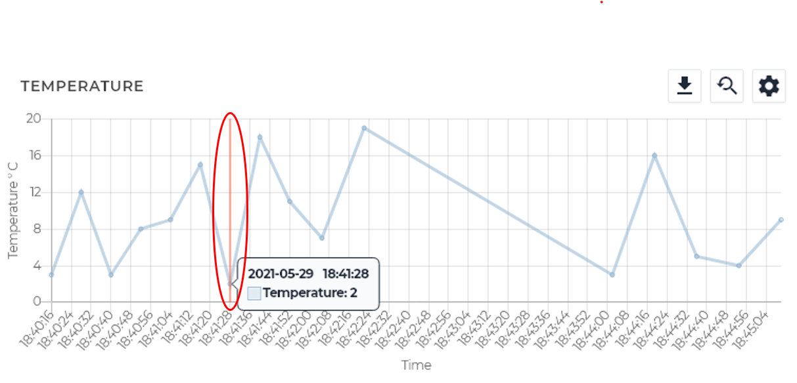

# Website

The website is written using the regular web stack (HTML/CSS/Javascript) but uses Tailwind CSS for styling. Any relevant javascript libraries will be mentioned along the way.

## Main Page

The main page contains basic information about all the devices that have been added to the project. It makes use of the Google Maps API to display the GPS coordinates of the devices. The devices are displayed as cards with some basic information.

Selecting any of the cards will open up a page containing more details about the device. This will be elaborated upon below.



### Fetching data

Whenever the home page loads, an async request is sent to firebase for the "Gliders" collection. Fields from each glider is collected to be used for displaying information for each card. At the same time, the **last seen** field is used for placing the marker on the map.

### Note!

Each read per field counts towards a quota in firebase. Caution is therefore advised when refreshing the page many times.




## Device Page

The device page contains more information about the device. This includes the data that it has collected. These are displayed in graphs. The coordinates for where the device has been is also shown in a map as can be seen at the top of the page.

The device is specified using URL parameters, as can be seen below:
```
device.html?gliderUID=039189
```

### Fetching data
Certain measures were taken to try reducing the number of reads from Firebase as much as possible.

A request is sent to firebase much like in the homepage. This request reads the names of all the missions (referred to as **documents** in firebase) present within the glider. This only fetches the names, not the data stored in each document as to reduce reads.



Data per mission is only fetched when a mission is chosen from the list, which prompts another request from Firebase. Data that has been read will remain saved until the page is refreshed. 

Data is saved as an array of JSON objects. The structure can be seen below:
```*.jsx
dataset = [obj1, obj2, ...];

obj1 structure:
"{date}T{time}": {data}

data structure:
data = {
        "dataType1": val1,
        "dataType2": val2,
        "dataType3": val3
       }
```

Example:
```*.jsx
dataset = 
[
  {
    "2020-03-28T02:24:12":
    {
      "T": 2,
      "P": 1,
      "C": 5,
    }
  },
  {...},
  ...
];
```

This dataset is then sorted chronologically.

It is also possible to view data over a custom date range, instead of a per-mission basis.



This works by going through the dataset, the ones in the website and the ones in Firebase, and checking whether the starting or ending date is present within the range of the mission. Any missions in-between the mission sets will be included. Once the relevant missions have been chosen, the dataset is sifted through to find the data that is within the actual date range.



This is essentially a 2-step process. Select all relevant missions, then select the specific values within those missions.

### Preparing the data for the graphs
The dataset collected cannot be used yet for plotting the graphs. Not all datatypes are present within each timestamp. Therefore, individual sets need to be created for each datatype.

A function has been made to find out different data types. In theory it should make it easier to add new types of data to the project. Referring to the example, the program will find the datatypes **T, P, C**. The program will then go through the entire dataset and save any values containing the datatype to the appropriate array.

The new dataset will therefore look like this. Notice the difference in structure for **coordinates**:

```*.jsx
dataObj =
{
  T:
  [
    {
      t:"2020-03-28T02:24:12",
      y: 2
    }, ...
  ],
  P:[...],
  C:[...],
  coordinates:
  [
    {
      t:"2020-03-28T02:24:12",
      lat: 60,
      lng: 11
    }, ...
  ]
}
```


### Graphs: Chart JS

Chart JS (link here) has been used for displaying the graphss, which plot the value with respect to time. A custom function has also been implemented to allow a vertical line to select a specific point on the graph.



Additionally, it is possible to pan around the graph and download the dataset as an .xlsx file.


## MIssion control

